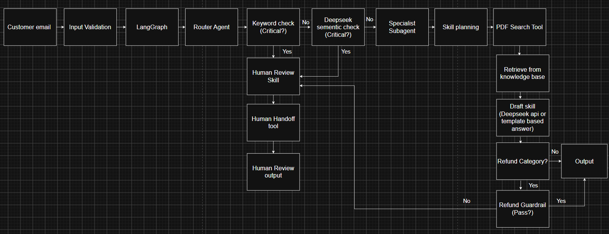

# 1. Initialize the system
Insert API key on env, then open bat file for each part 

# 2. Part 1 Email Customer Support Agent
### System workflow (will explain later)

### Demo Result (Example 1 - Category - Billing)

The customer reports that the same order was charged twice.
- **Critical issue: No**  
  The request is not a critical issue, so it continues through the normal process.

- **Category: Billing**  
  The system identifies the email as a billing problem.

- **Subagent: BillingSubagent**  
  The billing agent is selected to handle the request.

- **KnowledgeRetrievalSkill**  
  The system searches the internal FAQ for information about duplicate charges.

- **GroundedDraftSkill**  
  DeepSeek prepares a reply using the billing information found in the FAQ.

- **Refund guardrail: Not applied**  
  The email is classified as billing rather than a refund request.

- **Final result: Draft ready**  
  The system prepares a reply for the customer.

### (Example 2 -  Critical Technical Issue)

The customer reports that saved order information disappeared after the application crashed.

- **Category: Technical**  
  The system first identifies the email as a technical issue.

- **Critical issue: Yes**  
  The words “data loss” show that the problem is serious.

- **Subagent: HumanReview**  
 Critical cases go directly to human review.

- **HumanReviewSkill**  
  This skill prepares the case information for the support team.

- **Refund guardrail: Not used**  
  The email is not about a refund.

- **Handoff summary**  
  The prototype creates a short internal summary containing the customer’s problem. A real system would send this summary to a support-ticket queue.

- **Final result: Human review required**  
  The support team must investigate the possible data loss.

### (Example 3 - Reduce hallucination for refund policy)

The customer asks for a refund after 90 days for a product that was already used.
- **Critical issue: No**  
  The request is not an emergency.

- **Category: Refund**  
  The system identifies it as a refund request.

- **Subagent: RefundSubagent**  
  The refund agent processes the request.

- **KnowledgeRetrievalSkill**  
  The system searches the FAQ for the refund rules.

- **GroundedDraftSkill**  
  The system tries to prepare a reply using the available FAQ information.

- **Refund guardrail: Blocked**  
  The FAQ does not support promising a refund after 90 days for a used product.

- **HumanReviewSkill**  
  The case is prepared for the support team to review.

- **Response writer: Human review template**  
  A safe message is returned instead of DeepSeek guessing the refund policy.

- **Final result: Human review required**  
  The customer is informed that the support team will review the case.
