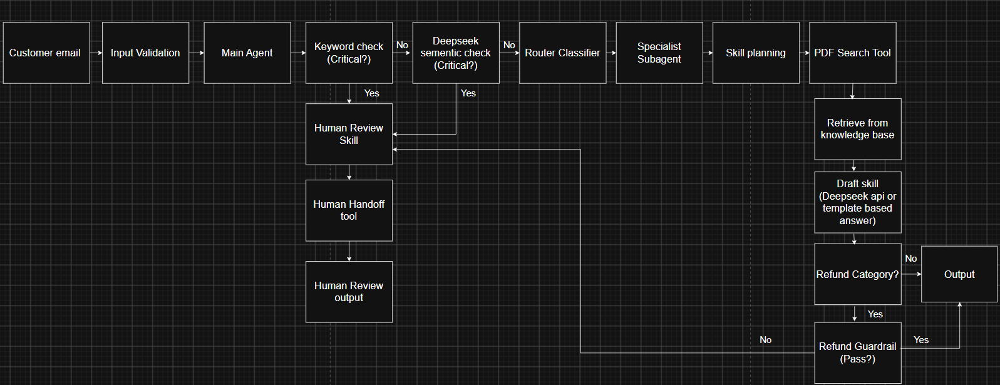

# 1. Initialize the system
Insert API key on env, then open bat file for each part 

# 2. Part 1 Email Customer Support Agent
### System workflow (will explain later)

### Demo Result 
The right panel shows how the email was processed:

- **Status: Draft ready**  
  The system successfully prepared a reply.

- **Critical issue: No**  
  The email was not serious, so it did not require human review.

- **Category: Refund**  
  The system identified the email as a refund request.

- **Subagent: RefundSubagent**  
  The refund agent was selected to handle the request.

- **Response writer: DeepSeek**  
  DeepSeek wrote the customer reply.
