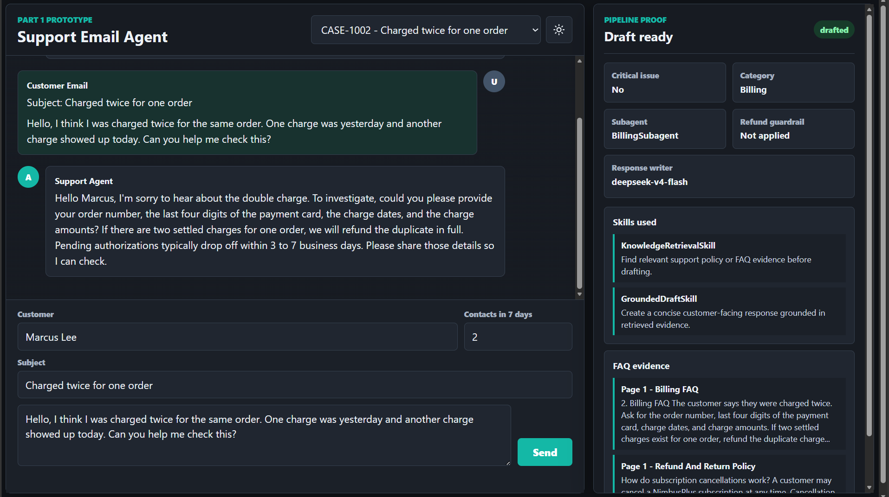
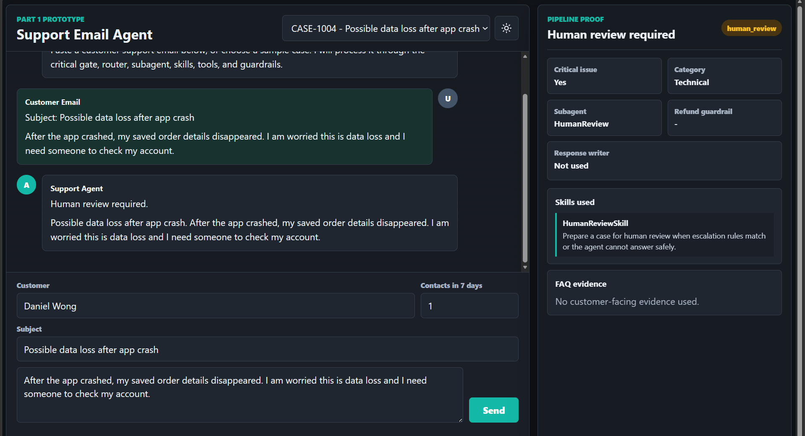
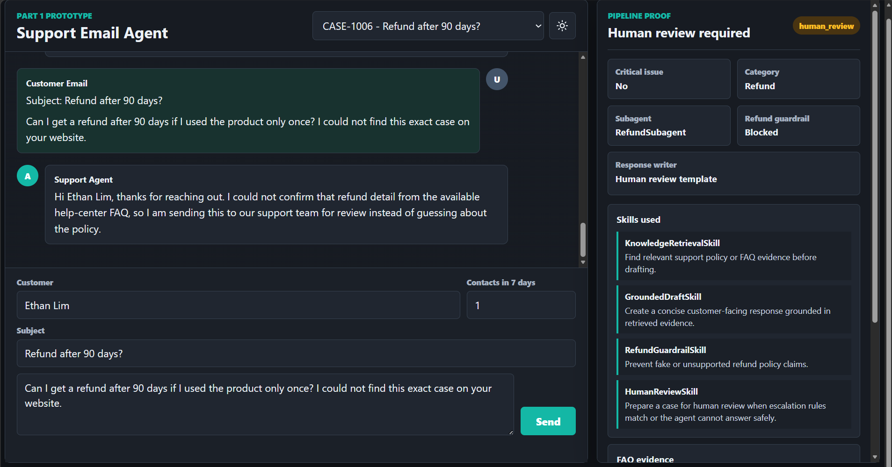
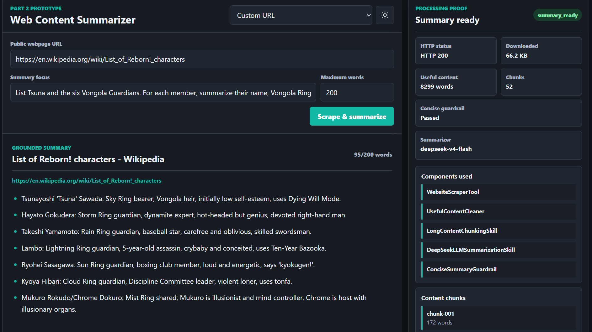

# 1. Initialize the system
Insert API key on env, then open bat file for each part 

# 2. Part 1 Email Support Agent
### (Example 1 - Category - Billing)

The customer reports that the same order was charged twice.
- **Critical issue: No**  
  The request is not a critical issue, so it continues through the normal process.

- **Category: Billing**  
  The system identifies the email as a billing problem.

- **Subagent: BillingSubagent**  
  The billing agent is selected to handle the request.

- **KnowledgeRetrievalSkill**  
  The system searches the internal FAQ for information about duplicate charges.

- **GroundedDraftSkill**  
  DeepSeek prepares a reply using the billing information found in the FAQ.

- **Refund guardrail: Not applied**  
  The email is classified as billing rather than a refund request.

- **Final result: Draft ready**  
  The system prepares a reply for the customer.

### (Example 2 -  Critical Technical Issue)

The customer reports that saved order information disappeared after the application crashed.

- **Category: Technical**  
  The system first identifies the email as a technical issue.

- **Critical issue: Yes**  
  The words “data loss” show that the problem is serious.

- **Subagent: HumanReview**  
 Critical cases go directly to human review.

- **HumanReviewSkill**  
  This skill prepares the case information for the support team.

- **Refund guardrail: Not used**  
  The email is not about a refund.

- **Handoff summary**  
  The prototype creates a short internal summary containing the customer’s problem. A real system would send this summary to a support-ticket queue.

- **Final result: Human review required**  
  The support team must investigate the possible data loss.

### (Example 3 - Reduce hallucination for refund policy)

The customer asks for a refund after 90 days for a product that was already used.
- **Category: Refund**  
  The classifier identifies the email as a refund request.

- **Critical issue: No**  
  The email is not an emergency, so LangGraph continues through the normal process.

- **Subagent: RefundSubagent**  
  LangGraph sends the case to the agent responsible for refund questions.

- **Refund guardrail: Blocked**  
  The PDF supports refunds within 30 days for unused products. It does not support this 90-day request for a used product.

- **Final result: Human review required**  
  The customer is informed that the support team will review the case.

# 3. Part 2 Web Content Summarizer
### Demo: Summarizing a Long Wikipedia Page

The user provides a public webpage, a summary focus and a maximum word limit.

In this example, the user asks the system to list Tsuna and the six Vongola Guardians from a Wikipedia page.

- **HTTP status: 200**  
  The webpage was downloaded successfully.

- **Downloaded: 66.2 KB**  
  This is the size of the downloaded webpage.

- **Useful content: 8,299 words**  
  The system removes menus, scripts, advertisements and other unnecessary webpage content.

- **Chunks: 52**  
  The cleaned content is divided into 52 smaller sections so it can be processed more easily.

- **WebsiteScraperTool**  
  Downloads the HTML from the public webpage.

- **UsefulContentCleaner**  
  Removes unnecessary webpage elements and keeps useful text.

- **LongContentChunkingSkill**  
  Divides the long text into smaller content chunks.

- **DeepSeekLLMSummarizationSkill**  
  DeepSeek reads the useful content and creates a summary based on the requested focus.

- **ConciseSummaryGuardrail**  
  Checks that the summary follows the maximum word limit and does not contain unsupported information.

- **Guardrail: Passed**  
  The generated summary passed the final checks.

- **Summarizer: DeepSeek**  
  DeepSeek successfully generated the summary.

- **Final result: Summary ready**  
  The final result contains 95 words, which is below the requested maximum of 200 words.
