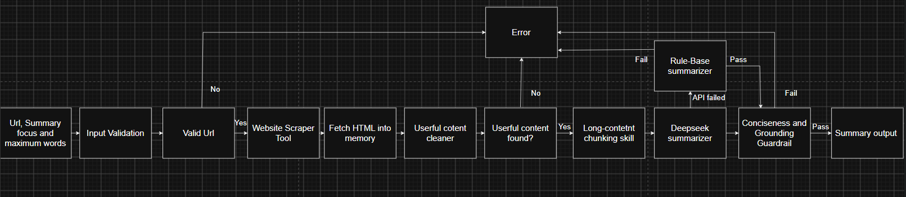

# Part 1: System Design & Critical Thinking
## Workflow and Agent

01. LangGraph - Connects the nodes, passes state and selects the next step.
02. Router Agent - Reads the email and selects its category.
03. BillingSubagent - Handles charges, payments, invoices and receipts.
04. RefundSubagent - Handles refunds, returns and cancellations.
05. TechnicalSubagent - Handles crashes, bugs and technical errors.
06. AccountSubagent - Handles login, password, profile and privacy questions.
07. ShippingSubagent - Handles delivery, tracking and package questions.
08. FeedbackSubagent - Handles suggestions, complaints and feedback.
## Skill
09. KnowledgeRetrievalSkill - Finds relevant information from the internal PDF.
10. GroundedDraftSkill - Creates a customer reply using retrieved PDF information.
11. RefundGuardrailSkill - Prevents refund claims that are not supported by the PDF.
12. HumanReviewSkill - Prepares critical or unsupported cases for human review.
## Tool
13. PDFSearchTool - Searches the internal PDF.
14. DaftBuilderTool - Builds a customer-facing reply.
15. RefundEvidenceCheckTool - Checks refund statements against PDF information.
16. HumanHandoffTool - Creates an internal ticket for the support team.
## Checks and Guardrails
17. Critical Keyword Check - Detects explicit data loss, service outage, security breach or repeated contact.
18. DeepSeek Meaning Check - Detects serious issues written using different words.
19. Refund Guardrail - Blocks refund replies that are unsupported by the PDF.

# Part 2:  Technical Implementation
## Workflow and Skill

1. LongContentChunkingSkill - Divides long webpage text into smaller sections.
2. DeepSeekLLMSummarizationSkill - Uses DeepSeek to create a focused summary.
3. GroundedSummarizationSkill - Creates a rule-based summary without an LLM API.
## Tool
4. URL Input Validation - Accepts only valid public webpage URLs
5. WebsiteScraperTool - Downloads webpage HTML into memory.
6. UsefulContentCleaner - Removes scripts, menus, advertisements and repeated content.
7. ConciseSummaryGuardrail - Checks the word limit, repetition and whether the summary is supported by the webpage.
