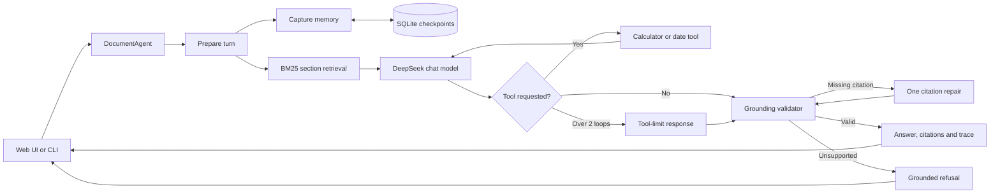

# Part 3 Architecture

## System flow

## Agent state and decisions

Each request enters a LangGraph state graph with a UUID request ID. The prepare
node updates memory and retrieves up to four relevant PDF sections. The model
receives only those sections as policy evidence and chooses either to answer or
to issue a structured tool call.

The graph makes the agentic decisions visible:

1. Retrieve relevant policy evidence.
2. Decide whether arithmetic or date reasoning requires a tool.
3. Return to the model with the tool result.
4. Stop the loop after two tool iterations.
5. Validate citations and support before releasing the answer.
6. Repair missing citations once, then block any still-unsupported answer.

The response exposes status, latency, retrieved section IDs, citations, tool
events, provider, and model. It does not expose hidden model reasoning.

## Grounding design

The sample PDF is parsed into an overview and eight numbered sections. Each
section receives a stable citation such as `P1:S3`, which combines the source
page and policy section.

BM25 was selected instead of embeddings because the corpus contains only nine
small sections. It is deterministic, fast, runs locally, and adds no embedding
API cost. Small query expansions handle common synonyms such as hotel/lodging
and car/vehicle. For a large or semantically diverse knowledge base, hybrid
vector plus keyword retrieval would be a stronger production design.

Policy answers must cite retrieved evidence. A citation not present in the
retrieval result is rejected. When no evidence or tool result supports a
non-social answer, the graph returns a grounded refusal.

## Memory design

LangGraph checkpoints persist messages and turn metadata in SQLite under a
conversation thread ID. The agent explicitly extracts and retains a user's name,
while recent messages support follow-up questions. Twenty recent turns are kept
in active state to bound prompt growth.

SQLite is an intentional prototype trade-off:

- Advantage: embedded, zero administration, durable across restarts.
- Limitation: not intended for many distributed application instances.
- Scale path: PostgreSQL checkpointer, connection pooling, migrations, and
  tenant-level authorization.

## Tool safety

The calculator accepts a restricted arithmetic AST rather than `eval`. It limits
expression length, node count, supported operators, and result magnitude.

The date tool accepts ISO dates and a controlled timezone. It supports today's
date, bounded date offsets, and day differences. The model is instructed to ask
for missing dates or quantities instead of inventing inputs.

## Failure handling

| Failure | Control |
| --- | --- |
| Missing or unreadable PDF | Startup fails with a clear document error |
| Missing API key or bad provider | Configuration validation blocks startup |
| Authentication, rate limit, timeout | Sanitized user-facing error |
| Oversized input | Message and HTTP body limits |
| Repeated tool calls | Maximum of two tool iterations |
| Invalid calculator/date input | Structured tool error returned to the model |
| Unsupported policy statement | Grounding validator blocks the answer |
| Fabricated citation | Citation must exist in retrieved evidence |
| Concurrent same-thread writes | Per-thread lock |
| Diagnosis after failure | Request IDs, latency, status, and rotating JSON logs |

## Framework trade-offs

- **LangGraph over raw API calls:** more setup, but explicit routing,
  checkpointed state, bounded loops, and testable nodes.
- **DeepSeek through `ChatOpenAI`:** uses an OpenAI-compatible client and keeps
  provider configuration isolated; the current Part 3 contract intentionally
  permits only DeepSeek.
- **Standard-library HTTP server:** minimal dependencies for a local demo;
  FastAPI plus an ASGI server would be preferable for authentication,
  middleware, metrics, and production concurrency.
- **Deterministic retrieval plus LLM response:** retrieval and safety decisions
  remain inspectable while natural-language generation stays flexible.

## Production evolution

A production version would add authenticated users, PostgreSQL memory, hybrid
retrieval, document versioning, asynchronous model calls, rate limiting,
distributed traces, evaluation datasets, prompt/version tracking, and a human
review path for sensitive policy decisions.

